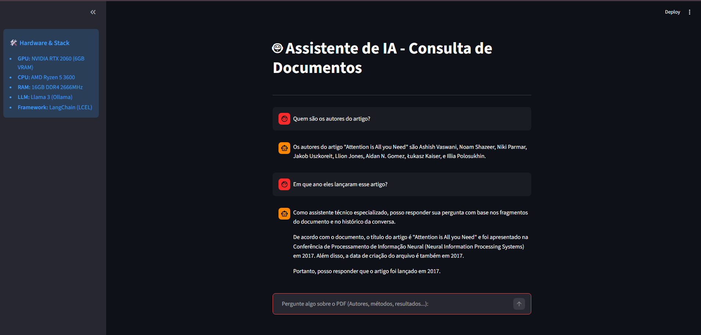

# 🤖 Local RAG Assistant: Inteligência de Documentos com Llama 3 & LCEL
Este projeto consiste em um assistente de inteligência artificial de alto desempenho, capaz de realizar leitura e análise de documentos PDF de forma 100% local. Utilizando a arquitetura RAG (Retrieval-Augmented Generation), o sistema garante respostas precisas e fundamentadas nos fragmentos do documento fornecido, eliminando alucinações e mantendo a total privacidade dos dados.

## 📸 Interface do Sistema (Em Execução)

*(Interface Streamlit com inferência acelerada por hardware)*

## 🚀 Diferenciais Técnicos
- **Privacidade e Soberania de Dados: Execução totalmente local via Ollama.**

- **Memória Contextual (Conversational RAG): O bot compreende referências a mensagens anteriores.**

- **Arquitetura LCEL: Utilização do padrão moderno do framework LangChain.**

- **Processamento em GPU (CUDA): Otimizado para NVIDIA RTX 2060.**

## 💻 Infraestrutura de Hardware (Lab Local)
- **GPU: NVIDIA GeForce RTX 2060 (6GB VRAM)**

- **CPU: AMD Ryzen 5 3600 (6 Cores / 12 Threads)**

- **RAM: 16GB DDR4 2666MHz**

- **Storage: SSD NVMe**

## 🛠️ Stack Tecnológica
- **LLM: Llama 3 (8B Parameters) via Ollama**

- **Embeddings: Ollama Embeddings**

- **Framework: LangChain v0.3+ (LCEL)**

- **Interface UI: Streamlit**

- **Banco Vetorial: ChromaDB**

## 🔧 Como Executar
### 1. Pré-requisitos
- Ter o Ollama instalado e o modelo Llama 3 baixado (ollama run llama3).

- Python 3.13 instalado.

### 2. Configuração do Ambiente
# Clone o repositório
- git clone [https://github.com/seu-usuario/RAG-Local-Llama3-LangChain.git](https://github.com/seu-usuario/RAG-Local-Llama3-LangChain.git)

# Entre na pasta
- cd RAG-Local-Llama3-LangChain

# Crie e ative o ambiente virtual
- python -m venv venv
- .\venv\Scripts\activate

# Instale as dependências
- pip install -r requirements.txt

### 3. Preparação dos Dados (ETL)
# Coloque seu arquivo PDF na pasta docs/ e execute o script de indexação:
- python indexar.py

### 4. Execução do Assistente
# Com o banco vetorial gerado, inicie a interface:
- streamlit run app.py

## 📂 Estrutura do Repositório
- **app.py: Interface do usuário e lógica de conversação RAG.**

- **indexar.py: Script de ETL (carregamento e vetorização).**

- **docs/: Diretório para os arquivos PDF originais.**

- **banco_vetorial/: Pasta onde os embeddings são persistidos localmente.**

- **requirements.txt: Dependências do projeto.**